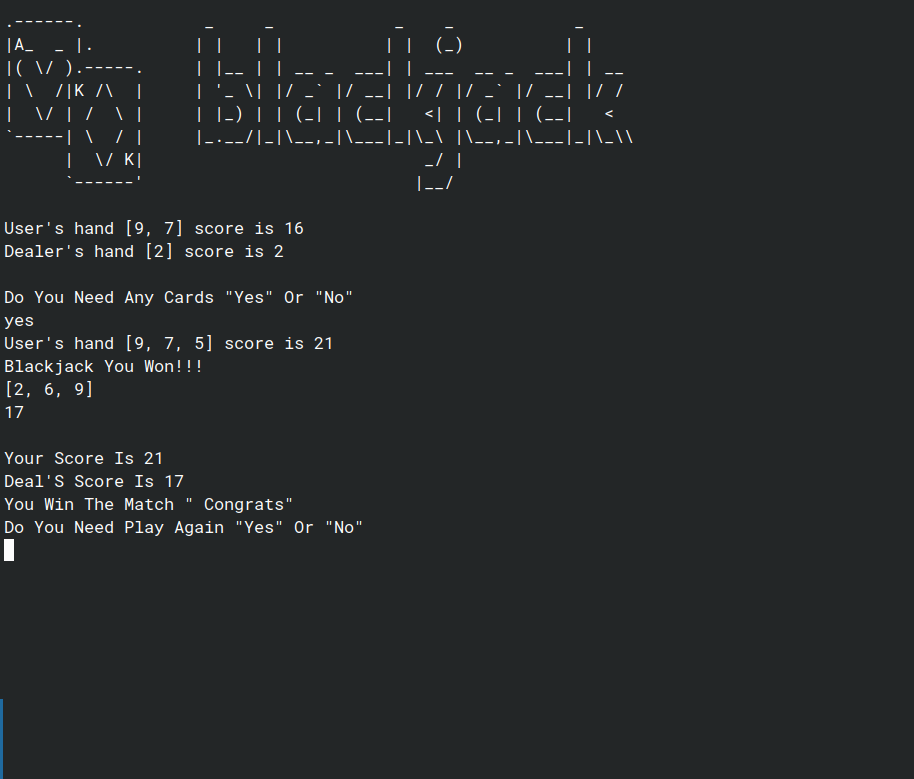

# 🃏 Blackjack (Python Console Game)

A simple **Blackjack** game built with Python where you play against the dealer.  
Try to get as close to **21** as possible without going over!

 ## How to Play

* Both you and the dealer get 2 cards.

* On your turn, choose:

        **Yes** → draw another card.

        **No** → keep your score.

 * If you go over 21 → Bust (you lose).

 * Dealer draws until score ≥ 16.

 * Compare scores → closest to 21 wins.

## Screenshot

